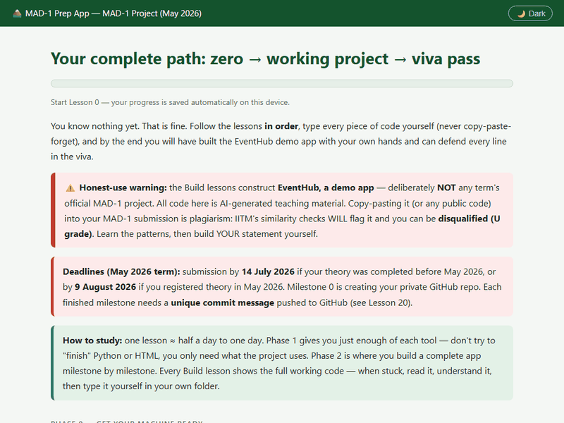

# 🏔️ MAD-1 Prep

**Learn every skill the IITM BS "Modern Application Development I" project needs, from absolute zero — then pass the viva.**

22 hands-on lessons · 290 real viva Q&A · 25 live-code drills · works on Windows, Android and the web · fully offline · pure dark mode 🌙



> ## 🚨 Read this before studying
> The Build lessons construct **EventHub — a demo event-booking app**. It is deliberately
> **NOT any term's official MAD-1 project statement** and not a submission-ready solution.
> All code here is AI-generated teaching material. **Copy-pasting it (or any public code) into
> your MAD-1 submission is plagiarism** — IITM's similarity checks will flag it and you can be
> **disqualified (U grade)**. Learn the patterns here, then write your own project line by line.

---

## ✨ What's inside

| | |
|---|---|
| 📚 **Lessons 0–13** | Terminal → Python → HTML → CSS/Bootstrap → HTTP → Flask → Jinja2 → Forms → SQL → SQLAlchemy → Sessions. Just enough of each — no fluff. |
| 🔨 **Builds 1–6** | Build **EventHub**, a complete demo booking app, one milestone at a time — the same architecture patterns every MAD-1 statement needs (⚠️ NOT the official project — see warning above). |
| 🚢 **Ship it** | Git & GitHub from the VS Code terminal (including switching GitHub accounts on Windows) + the exact submission rules. |
| 🎓 **Viva prep** | How both viva levels work + **290 questions with answers** + 25 "change your code now" live tasks proctors love. |
| 🌙 **Pure dark mode** | One click, remembered forever. Follows your system theme by default. |
| ✅ **Progress tracking** | Mark pages complete, watch your progress bar fill. Saved on your device — no account, no server. |
| 🧠 **Quiz mode** | Answers are hidden until you click the question — active recall built in. |

## 📥 Get it

### 🪟 Windows (recommended)

1. Go to **[Releases](../../releases/latest)** and download `MAD1-Prep.exe`.
2. Double-click it. That's it — no install, no admin rights.
3. Your browser opens the app at `http://127.0.0.1:8137`. Keep the black window open while studying.

> Windows SmartScreen may warn because the exe is unsigned — click **More info → Run anyway**.

**Updating:** click **⚙️ App settings → 🔄 Check for updates** inside the app. It pulls the
latest lessons straight from this repo — so when the project statement changes next term,
you get the new content without reinstalling.

### 🤖 Android

1. On your phone, go to **[Releases](../../releases/latest)** and download `MAD1-Prep.apk`.
2. Tap the downloaded file → allow "install from unknown sources" if asked → **Install**.
3. Open **MAD-1 Prep** from your app drawer. 100% offline — study on the bus.

### 🌐 Browser (nothing to install)

Open the Vercel deployment (link in the repo sidebar), or just clone this repo and
double-click `index.html`. Every page is plain HTML/CSS/JS — no build step, no server.

### 🐍 From source

```bash
git clone https://github.com/dipuda007/mad1-prep.git
cd mad1-prep
python -m http.server 8000    # then open http://localhost:8000
```

## 🚀 Deploy your own copy to Vercel

1. Fork / import this repo at [vercel.com/new](https://vercel.com/new).
2. Framework preset: **Other**. Build command: *(leave empty)*. Output directory: *(leave empty)*.
3. Deploy. `vercel.json` handles clean URLs; `.vercelignore` keeps the build folders out.

## 🗂️ Repo layout

```
├── *.html, style.css, app.js   ← the app itself (flat, no build step)
├── desktop/                    ← Windows launcher (Python + PyInstaller)
├── android/                    ← Android WebView wrapper (built by CI)
├── .github/workflows/          ← builds exe + apk on every version tag
├── docs/                       ← README media
└── vercel.json                 ← static hosting config
```

## 🔄 Releasing a new version (maintainers)

```bash
git commit -am "New term content"
git push
git tag v1.1.0
git push origin v1.1.0
```

GitHub Actions builds `MAD1-Prep.exe` + `MAD1-Prep.apk` and attaches both to the
release automatically. Existing exe users get the new content via **Check for updates**.

## ⚖️ Honest-use note

This is a *study companion*: it teaches concepts through a demo app (EventHub) that is
intentionally different from the official project. IITM rules require you to **build,
understand and defend your own submission** — type the code yourself, commit milestone by
milestone, and declare any AI usage in your report. Submitting code you can't explain, or
code that matches something public, ends in a **U grade**. Don't risk it.

---

Made with ☕ and mild viva panic. If this helped you pass, star the repo ⭐
